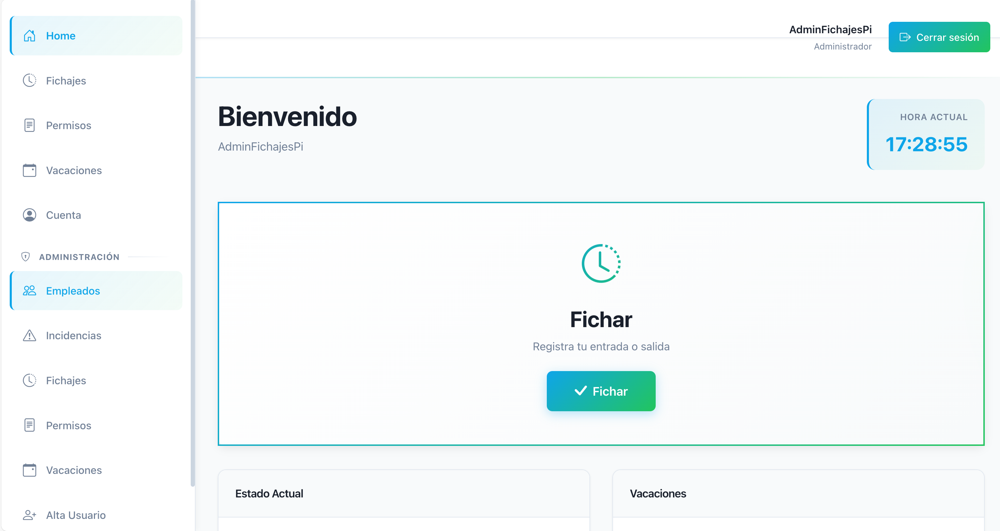

# Fichaje - Sistema de Registro de Jornada Laboral

[](https://turbo.build/repo)
[](https://pnpm.io/)
[](https://angular.io/)
[](https://spring.io/projects/spring-boot)
[](https://adoptium.net/temurin/releases/)
[](deploy/)
[](https://github.com/jamataran/fichaje/actions/workflows/codeql.yml)
[](https://northflank.com)
[](https://gdpr-info.eu/)
[](https://www.boe.es/buscar/act.php?id=BOE-A-2019-5720)

## 📋 Descripción

**Fichaje** es una solución integral de **registro de jornada laboral** diseñada para cumplir la normativa española de control horario (RDL 8/2019). Permite a empresas gestionar de forma centralizada:

- 📊 **Fichajes de entrada/salida** con sello de fecha/hora y auditoría completa
- 👥 **Gestión de usuarios** y perfiles de acceso
- 📅 **Calendarios laborales** personalizables
- 🏖️ **Gestión de vacaciones** y ausencias
- ⚠️ **Registro de incidencias** laborales
- 📈 **Informes y reportes** descargables por empleado
- 🔐 **Acceso del trabajador** a sus propios registros

Todo con una **interfaz web intuitiva**, **backend robusto** en Spring Boot y **base de datos MySQL** con retención de datos.

### 🎯 Casos de uso

- Empresas medianas y grandes que necesitan control de jornada laboral
- Cumplimiento normativo español de registro de horas trabajadas
- Gestión centralizada de horarios y ausencias
- Auditoría y trazabilidad de todos los registros

---

## 🌐 Demo pública

Prueba la aplicación sin instalación:

🔗 **URL Demo**: [https://demo.fichaje.org](https://demo.fichaje.org)

- **Usuario**: `fichajesPi000`
- **Contraseña**: `fichajesPi000`



---

## 👥 Autores del Fork

Este fork ha sido ideado y mantenido por:

[](https://www.linkedin.com/in/javier-velasco-garc%C3%ADa-32434827b/)
[](https://www.linkedin.com/in/jamataran/)

**Repositorio actual**: https://github.com/jamataran/fichaje  
**Repositorio original**: https://github.com/alejandroferrin/fichajespi  
**Wiki del proyecto**: https://github.com/jamataran/fichaje/wiki

---

## 📋 Tabla de contenidos
- [Requisitos](#requisitos)
- [Instalación rápida con Docker Compose](#instalación-rápida-con-docker-compose)
- [Cumplimiento normativo](#-cumplimiento-normativo-español-rdl-82019)
- [Acceso y credenciales](#acceso-y-credenciales)
- [Características de seguridad y auditoría](#-características-de-seguridad-y-auditoría)
- [Desarrollo](#desarrollo)
- [Enlaces útiles](#enlaces-útiles)

## ⚙️ Requisitos
- Docker y Docker Compose (versión 3.9+)
- Máquina con al menos **2 vCPU**, **2 GB RAM** y **10 GB de disco** libres
- Puerto 80, 81, 3306 y 8080 disponibles (configurables)

## 🚀 Instalación rápida con Docker Compose

### Opción 1: Con imágenes preconstruidas (recomendado)

1. **Descargar archivo `.env`**:
```bash
curl -o deploy/prod/.env https://raw.githubusercontent.com/jamataran/fichaje/main/deploy/prod/.env.example
# Edita deploy/prod/.env con tus valores (MySQL, JWT, SMTP, etc.)
```

2. **Levantar la aplicación completa**:
```bash
docker compose -f deploy/prod/compose.yaml --env-file deploy/prod/.env up -d
```

3. **Acceder a la aplicación**:
   - 🌐 **Frontend**: http://localhost
   - 🔌 **API Backend**: http://localhost:8080
   - 🗄️ **phpMyAdmin**: http://localhost:81

#### Archivo Docker Compose completo (`deploy/prod/compose.yaml`)

Si prefieres el archivo completo para copiar y pegar:

```yaml
version: '3.9'

services:
  db:
    container_name: fichaje_db
    image: mysql:8.0
    ports:
      - "3306:3306"
    environment:
      MYSQL_ROOT_PASSWORD: ${MYSQL_ROOT_PASSWORD}
      MYSQL_DATABASE: ${MYSQL_DATABASE}
      MYSQL_USER: ${MYSQL_USER}
      MYSQL_PASSWORD: ${MYSQL_PASSWORD}
      TZ: ${TZ:-Europe/Madrid}
    volumes:
      - db_data:/var/lib/mysql
    healthcheck:
      test: ["CMD", "mysqladmin", "ping", "-h", "localhost", "-u$$MYSQL_USER", "-p$$MYSQL_PASSWORD"]
      interval: 10s
      timeout: 5s
      retries: 10
    restart: unless-stopped
    networks:
      - fichajes-network

  backend:
    container_name: fichaje_be
    image: ${BACKEND_IMAGE:-ghcr.io/jamataran/fichaje-backend:latest}
    environment:
      TZ: ${TZ:-Europe/Madrid}
      SPRING_DATASOURCE_URL: jdbc:mysql://db:3306/${MYSQL_DATABASE}?useSSL=false&serverTimezone=Europe/Madrid
      SPRING_DATASOURCE_USERNAME: ${MYSQL_USER}
      SPRING_DATASOURCE_PASSWORD: ${MYSQL_PASSWORD}
      CLIENT_URL: ${CLIENT_URL}
      SPRING_MAIL_HOST: ${SPRING_MAIL_HOST}
      SPRING_MAIL_PORT: ${SPRING_MAIL_PORT}
      SPRING_MAIL_USERNAME: ${SPRING_MAIL_USERNAME}
      SPRING_MAIL_PASSWORD: ${SPRING_MAIL_PASSWORD}
      JWT_SECRET: ${JWT_SECRET}
    ports:
      - "8080:8080"
    depends_on:
      db:
        condition: service_healthy
    restart: unless-stopped
    networks:
      - fichajes-network

  frontend:
    container_name: fichaje_fe
    image: ${FRONTEND_IMAGE:-ghcr.io/jamataran/fichaje-frontend:latest}
    ports:
      - "80:80"
    environment:
      TZ: ${TZ:-Europe/Madrid}
    restart: unless-stopped
    networks:
      - fichajes-network

  phpmyadmin:
    container_name: fichaje_dbadmin
    image: phpmyadmin:latest
    ports:
      - "81:80"
    environment:
      PMA_ARBITRARY: 1
      PMA_HOST: db
      PMA_USER: ${MYSQL_USER}
      PMA_PASSWORD: ${MYSQL_PASSWORD}
    depends_on:
      - db
    restart: unless-stopped
    networks:
      - fichajes-network

networks:
  fichajes-network:
    name: fichajes-prod-network

volumes:
  db_data:
    name: fichajes_db_prod_data
```

**Detener la aplicación**:
```bash
docker compose -f deploy/prod/compose.yaml --env-file deploy/prod/.env down
```

**Ver logs en tiempo real**:
```bash
docker compose -f deploy/prod/compose.yaml --env-file deploy/prod/.env logs -f
```

### Opción 2: Construir imágenes localmente

Si prefieres compilar tú mismo:

```bash
# 1. Construir imágenes
docker build -t fichaje-backend:local apps/fichaje-be
docker build -t fichaje-frontend:local apps/fichaje-fe

# 2. Actualizar deploy/prod/.env
export FRONTEND_IMAGE=fichaje-frontend:local
export BACKEND_IMAGE=fichaje-backend:local

# 3. Levantar stack
docker compose -f deploy/prod/compose.yaml --env-file deploy/prod/.env up -d
```

## ✅ Acceso y credenciales

Tras la instalación, la aplicación crea un usuario administrador por defecto:

- **Usuario**: `fichajesPi000`
- **Contraseña**: `fichajesPi000`

⚠️ **IMPORTANTE**: Cambia estas credenciales inmediatamente en tu primer acceso.

## 🛡️ Cumplimiento normativo español - RDL 8/2019

Fichaje está diseñado para **cumplir la normativa española de registro de jornada** establecida por el [Real Decreto-Ley 8/2019](https://www.boe.es/buscar/act.php?id=BOE-A-2019-5720), que obliga a las empresas a llevar un registro detallado de las horas trabajadas.

### Características de cumplimiento:

✅ **Fichajes con sello de fecha/hora**: Cada entrada/salida se registra con timestamp exacto  
✅ **Auditoría y trazabilidad completa**: Registro immutable de todos los eventos  
✅ **Retención ≥4 años**: Almacenamiento persistente de todos los datos  
✅ **Acceso del trabajador**: Los empleados pueden consultar sus propios registros  
✅ **Reportes descargables**: Exportación de informes por empleado  
✅ **Gestión de ausencias**: Control de vacaciones, permisos e incidencias  

### Configuración recomendada para España:

1. **Zona horaria**: Configurar a `Europe/Madrid` (ya por defecto)
2. **Retención de datos**: Mínimo 4 años (configurable en base de datos)
3. **Auditoría**: Activa por defecto en todas las operaciones
4. **Permisos**: Configurar acceso basado en roles (Admin, Supervisor, Empleado)
5. **Reportes**: Descargar informes mensuales/anuales para auditoría

**Nota legal**: Los detalles específicos del cumplimiento normativo dependen de tu asesoría legal. Esta aplicación proporciona las herramientas necesarias para implementar un control de jornada conforme a la normativa.

## 🔐 Características de seguridad y auditoría

- 🔑 **Autenticación JWT**: Token-based segura
- 👤 **Control de acceso por roles**: Admin, Supervisor, Empleado
- 📝 **Auditoría completa**: Quién, qué, cuándo en cada acción
- 🔒 **Contraseñas hasheadas**: Algoritmos seguros (bcrypt)
- 🛡️ **HTTPS recomendado**: Compatible con certificados SSL/TLS
- 📊 **RGPD compliant**: Gestión segura de datos personales

## 👨‍💻 Desarrollo

Si quieres contribuir o desarrollar localmente, consulta **[SETUP.md](SETUP.md)** donde encontrarás:

- Cómo levantar el entorno completo con **un solo comando** usando Turborepo
- Estructura del monorepo (apps, packages, deploy)
- Comandos para desarrollo, tests y builds
- Puertos y servicios disponibles en local

**Inicio rápido para desarrolladores**:

```bash
# 1. Instalar dependencias
pnpm install

# 2. Preparar entorno de desarrollo
cp deploy/dev/.env.example deploy/dev/.env

# 3. Levantar todo (infraestructura + backend + frontend)
pnpm dev:stack
```

Esto arrancará:
- MySQL (puerto 3307)
- phpMyAdmin (puerto 8081)
- MailHog para captura de emails (puerto 8025)
- Backend Spring Boot (puerto 8080)
- Frontend Angular (puerto 4200)

## 📚 Enlaces útiles
- 🔗 **[Guía de desarrollo](SETUP.md)** - Estructura del monorepo y comandos Turborepo
- 🐳 **[Orquestación Docker](DOCKER.md)** - Detalles de compose dev/test/prod
- 🔄 **[CI/CD](https://github.com/jamataran/fichaje/wiki/CI-CD)** - Pipeline de integración continua
- 📖 **[Wiki del proyecto](https://github.com/jamataran/fichaje/wiki)** - Documentación completa
- 🌐 **[Demo en línea](https://demo.fichaje.org)** - Prueba la aplicación
- 👶 **[Proyecto original](https://github.com/alejandroferrin/fichajespi)** - Repositorio base
